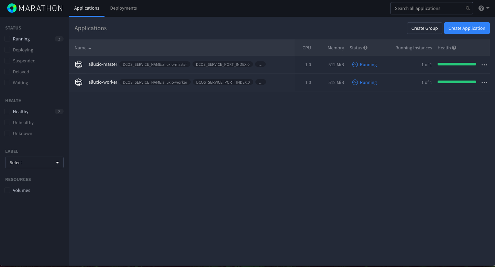

# About the WebUI

## Introduction

Lucid embeds a useful dashboard created in [Vue.js](http://vuejs.org) to easily manage your node.

This dashboard allows you, for example, to:

* Handle Stored Data
* Issue Authentication Tokens
* Manage Distributed Instances
* Manage ACLs or Encryption

